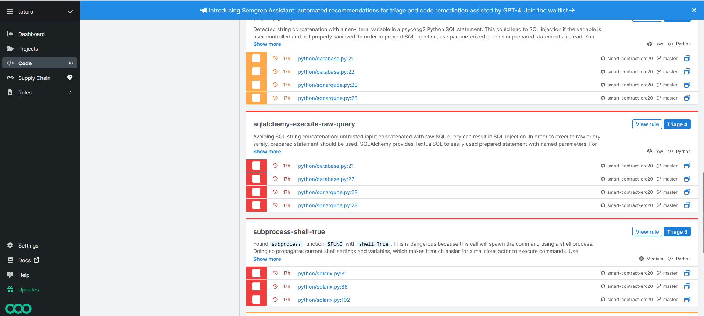
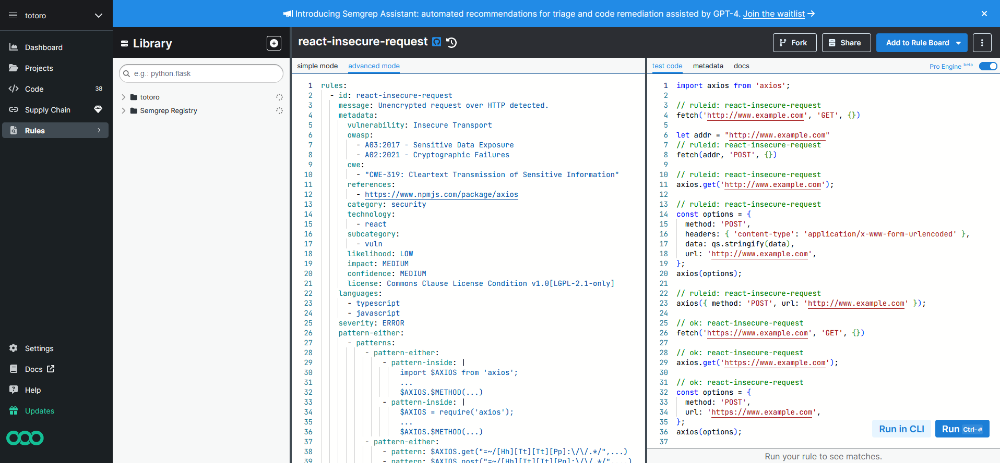

# smart-contract-erc20-ui

Ce référentiel est constitué d'un projet multi-modules pour un contrat intelligent développé en utilisant le tutoriel ERC20 Ethereum et une interface utilisateur de démarrage Alchemy pour tester certaines fonctionnalités.

Pour plus de détails, veuillez vous référer :

- Smart Contract [ReadMe](./smart-contract-erc20/README.md)
- Alchemy UI [ReadMe](./alchemy-ui/README.md)

Analyse de code Semgrep

##
