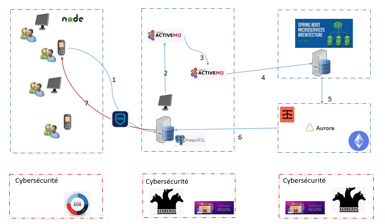

# Introduction

---

La création d\'un smart contract pour l\'énergie solaire via la
blockchain peut être réalisée en suivant les étapes suivantes :

```
1.  Choisissez la plateforme de blockchain pour votre smart contract :
    Ethereum est la plateforme la plus populaire pour les smart
    contracts, mais il existe également d\'autres options telles que
    Tron, EOS, etc.

2.  Créez un nouveau contrat intelligent dans votre IDE. Pour cela, vous
    pouvez utiliser Solidity, un langage de programmation de contrat
    intelligent populaire pour Ethereum. Vous pouvez également utiliser
    Vyper, un autre langage de programmation de contrat intelligent.

3.  Définissez les variables pour stocker les informations nécessaires,
    telles que l'adresse du producteur d'énergie, la quantité
    d'énergie produite et le prix de l'énergie.

4.  Utilisez les fonctions pour écrire la logique de votre smart
    contract. Par exemple, vous pouvez utiliser une fonction pour
    permettre aux producteurs d'énergie solaire de stocker leurs
    informations sur la blockchain, une autre pour permettre aux
    consommateurs d'acheter de l'énergie, etc.

5.  Utilisez des contrats intelligents existants ou créez-en de nouveaux
    pour gérer les transactions financières. Par exemple, vous pouvez
    utiliser des contrats intelligents pour gérer les paiements en
    cryptomonnaies, les remboursements, les remises, etc.

6.  Testez votre contrat intelligent en utilisant un environnement de
    test. Vous pouvez utiliser des outils tels que Ganache pour créer un
    environnement de test local ou utiliser des environnements de test
    en ligne tels que Rinkeby ou Kovan.

7.  Déployez votre smart contract sur la blockchain. Pour cela, vous
    pouvez utiliser un service tel que Remix ou Truffle pour déployer
    votre contrat intelligent sur la blockchain.

8.  Mettez en place une interface utilisateur pour permettre aux
    utilisateurs d'interagir avec votre contrat intelligent. Vous
    pouvez créer une application web ou mobile qui interagit avec votre
    contrat intelligent pour permettre aux producteurs de publier leur
    production d'énergie, et aux consommateurs d'acheter de l'énergie
    solaire.
```

---

En suivant ces étapes, vous pouvez créer un smart contract pour
l'énergie solaire via la blockchain. Cela peut aider à faciliter les
transactions entre les producteurs d'énergie solaire et les
consommateurs, ainsi qu'à promouvoir l'utilisation de l'énergie
renouvelable.

Effectivement, pour un smart contract qui concerne l'énergie solaire,
il est important de spécifier les caractéristiques des panneaux solaires
utilisés pour la production d'énergie. Cela permet de garantir la
qualité et la fiabilité de l'énergie produite.

Pour inclure ces caractéristiques dans le smart contract, vous pouvez
ajouter des variables pour stocker les informations sur les panneaux
solaires utilisés pour la production d\'énergie, telles que :

```
-   La puissance nominale du panneau solaire en watts crête (Wc)
-   L'efficacité du panneau solaire en pourcentage (%)
-   Le nombre de panneaux solaires utilisés pour la production
    d'énergie
-   La surface totale des panneaux solaires en mètres carrés (m²)
-   Le fabricant et le modèle des panneaux solaires
```

Vous pouvez également utiliser des fonctions pour valider les
informations sur les panneaux solaires, telles que vérifier si la
puissance nominale des panneaux solaires correspond à la surface totale
des panneaux solaires et à leur efficacité.

En incluant ces informations dans le smart contract, vous pouvez
garantir que l'énergie produite est de haute qualité et que les
consommateurs savent exactement ce qu'ils achètent.

Le smart contract pour l'énergie solaire via la blockchain peut inclure
les fonctionnalités suivantes :

```
1.  Variables pour stocker les informations nécessaires, telles que
    l'adresse du producteur d'énergie, la quantité d'énergie produite
    et le prix de l'énergie, ainsi que des informations sur les
    panneaux solaires utilisés pour la production d'énergie, telles que
    la puissance nominale, l'efficacité, le nombre de panneaux solaires
    et la surface totale des panneaux solaires.

2.  Fonctions pour écrire la logique du smart contract, telles que des
    fonctions pour permettre aux producteurs d'énergie solaire de
    stocker leurs informations sur la blockchain, une fonction pour
    permettre aux consommateurs d'acheter de l'énergie, ainsi que des
    fonctions pour valider les informations sur les panneaux solaires.

3.  Contrats intelligents existants ou nouveaux pour gérer les
    transactions financières, telles que des contrats intelligents pour
    gérer les paiements en cryptomonnaies, les remboursements et les
    remises.

4.  Test de la fonctionnalité du smart contract en utilisant un
    environnement de test, tel que Ganache ou Rinkeby.

5.  Déploiement du smart contract sur la blockchain en utilisant un
    service tel que Remix ou Truffle.

6.  Mise en place d'une interface utilisateur pour permettre aux
    utilisateurs d'interagir avec le smart contract et d'acheter de
    l'énergie solaire.
```

En incluant ces fonctionnalités dans le smart contract, les producteurs
et les consommateurs peuvent faciliter les transactions liées à
l'énergie solaire via la blockchain, garantir la qualité et la
fiabilité de l'énergie produite, ainsi que promouvoir l'utilisation de
l'énergie renouvelable.

# Contrat Solarix

```
Voici une description des différentes fonctions dans le contrat Solarix :

   => IERC20 interface : cette interface définit les méthodes nécessaires pour interagir avec un token ERC20 standard.
      Il s'agit d'une interface standard pour les tokens Ethereum.

    constructor() : le constructeur du contrat qui est exécuté lorsqu'un nouveau contrat Solarix est déployé.
    Il initialise plusieurs variables, notamment le propriétaire du contrat, le producteur, la quantité d'énergie produite, le prix de l'énergie, la limite de production et les informations sur le panneau solaire.

    sellEnergy(uint256 quantity) : cette fonction est utilisée pour vendre de l'énergie et transférer les fonds au producteur.
    Elle vérifie si le montant envoyé est suffisant pour la quantité d'énergie demandée et si suffisamment d'énergie est disponible pour la vente. Si toutes les conditions sont remplies, la fonction transfère les fonds au producteur.

    setEnergyPrice(uint256 price) : cette fonction permet au producteur de modifier le prix de l'énergie.

    addEnergyProduction(uint256 production) : cette fonction permet au producteur d'ajouter de la production d'énergie.
    Elle vérifie si le producteur est autorisé à ajouter de la production d'énergie et si la production ajoutée ne dépasse pas la limite de production.

    setSolarPanel(uint256 _power, uint256 _efficiency, uint256 _quantity, uint256 _surface, string memory _manufacturer, string memory _model) : cette fonction permet au producteur de modifier les informations sur le panneau solaire utilisé pour produire de l'énergie.

    getSolarPanel() : cette fonction permet de récupérer les informations sur le panneau solaire actuellement utilisé pour produire de l'énergie.

    withdrawFunds() : cette fonction permet au propriétaire du contrat de retirer les fonds disponibles sur le contrat.

    setProductionLimit(uint256 limit) : cette fonction permet au producteur de modifier la limite de production.

    getProductionLimit() : cette fonction permet de récupérer la limite de production actuelle.

    getCurrentProduction() : cette fonction permet de récupérer la quantité d'énergie produite qui n'a pas encore été vendue.

    setProducer(address producerAddress) : cette fonction permet au propriétaire du contrat de modifier l'adresse du producteur.

    getProducer() : cette fonction permet de récupérer l'adresse actuelle du producteur.

    kill() : cette fonction permet au propriétaire du contrat de détruire le contrat et de récupérer tous les fonds restants sur le contrat.

    getContractBalance() : cette fonction permet de récupérer le solde du contrat.

    getOwnerSummary() : cette fonction permet de récupérer un résumé des soldes du propriétaire, y compris le solde de token ERC20 et le solde ETH.
```

# ERC20 project Blockchain

Ce projet illustre un cas d'utilisation de base du jeton ERC-20, intégrant d'autres outils couramment utilisés aux côtés
de Hardhat dans l'écosystème.

Le projet est fourni avec un contrat, un test pour ce contrat, un exemple de script qui déploie ce contrat et un exemple
d'une implémentation de tâche, qui liste simplement les comptes disponibles. Il est également livré avec une variété
d'autres outils,
préconfiguré pour fonctionner avec le code du projet.




Le code a été sourcé
from [UNDERSTAND THE ERC-20 TOKEN SMART CONTRACT](https://ethereum.org/en/developers/tutorials/understand-the-erc-20-token-smart-contract/)
tutorial.

Les tâches suivantes sont préconfigurées

```shell
npm audit fix --force
npx hardhat accounts
npx hardhat compile
npx hardhat clean
npx hardhat test
npx hardhat node
npx hardhat help
set REPORT_GAS=true
npx hardhat test
npx hardhat coverage
npx hardhat run scripts/deploy.js
node scripts/deploy.js
npx eslint "**/*.js"
npx eslint "**/*.js" --fix
npx prettier "**/*.json" --write
npx solhint "contracts/**/*.sol"
npx solhint "contracts/**/*.sol" --fix
```

# Smart Contract Build & Test

yarn doit être installé pour utiliser les commandes yarn afin de créer le contrat intelligent. Cependant, les tâches de
casque ci-dessus peuvent
également être utilisé pour compiler et tester le Smart Contract.

Vous trouverez ci-dessous des commandes à exécuter séquentiellement pour créer le contrat intelligent

```shell
yarn install
yarn compile
yarn test
```


# Etherscan verification

Pour la vérification Etherscan, vous devez d'abord déployer un contrat sur un réseau Ethereum pris en charge par
Etherscan, tel que Aurora.

Dans ce projet, copiez le fichier .env.example dans un fichier nommé .env, puis modifiez-le pour remplir les détails.
Entrez votre clé API Etherscan, l'URL de votre nœud Ropsten (par exemple d'Alchemy) et la clé privée du compte qui
enverra la transaction de déploiement. Avec un fichier .env valide en place, déployez d'abord votre contrat :

```shell
yarn deploy:optimism
```

```shell
yarn deploy:aurora
```

```shell
yarn deploy:infura
```

```
https://app.infura.io/dashboard/ethereum/3788234e401b4f6d81558b467e22b0b0/settings
```

Ensuite, copiez l'adresse de déploiement et collez-la pour remplacer `DEPLOYED_CONTRACT_ADDRESS` dans cette commande :

```shell
npx hardhat verify --network ropsten DEPLOYED_CONTRACT_ADDRESS 10000
```

```shell
npx hardhat verify --network ropsten 0xf39fd6e51aad88f6f4ce6ab8827279cfffb92266 10000
```

Analyze "smart-contract-deployment": sqp_688bf76fdd082f014615bc1c86bea6eeff43d2d4
